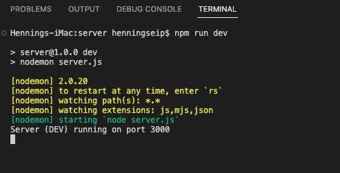

# Building the Client - Server Student Poll Application

## Building the Server
Open a new Terminal in VSCode and change into the server directory:
```
cd server
```
In the server directory install the following node modules:
```
npm i bcrypt cors dotenv express mysql
npm i nodemon -D
```

With the cursor highlight the server directory. Click on the folder with the plus sign above to create the following directories:
- config
- controllers
- public
- routes

The directories will help us to organize our code and make the project easier to read and maintain.

With the cursor highlight the server directory. Click on the document with the plus sign and create the following files (note the dot as part of the name for .env and .gitignore):
- server.js
- .env
- .gitignore

Click on .gitignore to open the empty file. Add the following lines:
```
node_modules
.env
request.rest
```
Close the .gitignore file.  

Click on the package.json file. Add the following line to "scripts" brace (don't forget the comma at the end of the line!):
```
"dev": "nodemon server.js",
```
Click on the empty .env file and add the following lines:
```
NODE_ENV=DEV
NODE_PORT=3000
DB_HOST=localhost
DB_PORT=3306
DB_USER=baseuser
DB_PASSWORD=base
DB=BASE
SALT=
```
To add the SALT use the VSCode Terminal (at the bottom of the VSCode screen) and enter:
```
node
const bcrypt = require("bcrypt");
const salt = await bcrypt.hash("BASE", 10);
console.log(salt)
```
Copy the string displayed by the console.log behind the SALT definition in the .env file.
In the Terminal exit node by pressing Crtl + D

#### code file: server.js
We now create the program files for our server:
Click on server.js to open the empty file. Add the following lines:
```
require("dotenv").config(); // read the contents of the .env file
const express = require("express"); // load the node.js webserver
const app = express();

const cors = require("cors"); // load the cross-origin resource sharing management tool
app.use(cors())

app.use(express.json()); // configure the webserver to convert all incoming and outgoing data to json format
app.use("/api", require("./routes/poll")); // load our routes file for api calls

// for production we must serve the HTML page that holds the code that runs in the browser
if (process.env.NODE_ENV==='PROD'){ 
  let path = require('path');
  app.use(express.static(__dirname + '/public'));
  app.get('/', (req, res) => {
    res.sendFile(path.resolve('public/index.html'))
  });
}

// all else goes to 'page not found'
app.all("*", (req, res) => {
  res.sendStatus(404);
});

// start the server
app.listen(process.env.NODE_PORT, () =>
  console.log(`Server (${process.env.NODE_ENV}) running on port ${process.env.NODE_PORT}`)
);
```
#### code file: dbConnection.js
Click on the config directory and create an empty file named **dbConnection.js**. Enter the following code:
```
const mysql = require('mysql'); // load the MySQL connection code which will communicate with the database.

// create a configuration to access our database.
const dbUserConn = mysql.createPool({
    connectionLimit: 10,
    host: process.env.DB_HOST,
    port: process.env.DB_PORT,
    database: process.env.DB,
    user: process.env.DB_USER,
    password: process.env.DB_PASSWORD
})

// make the above code accessible for other code modules
module.exports = dbUserConn;
```
#### code file: pollController.js
Now we create our business logic that processes the data coming from the browser and the database. Click on the controllers folder and create a new file named pollController.js. Add the following code:
```
const dbUserConn = require("../config/dbConnection"); // load the database connection
const mysql = require("mysql"); // load the MySQL module
const bcrypt = require("bcrypt"); // load the bcrypt cypher module

/***********
 * The joblist function returns the list of job titles with additional statistical information
 **********/
const jobList = (req, res) => {
  return new Promise((resolve, reject) => {
    dbUserConn.query(
      `
                Select * from Jobs_In_Demand;
        `,
      (err, results) => {
        if (err) {
          reject(err);
        }
        resolve(results);
      }
    );
  })
  .then(results => {
    res.json(results)
  }) .catch(err => {
    console.log(err)
    res.sendStatus(500)
  });
};

/***************
 * The poll function receives the user input and stores it the database
 **************/
const poll = (req, res, next) => {
  const { email, JobTitle, CreatorEmail } = req.body;

  bcrypt
    .hash(email.split("@")[0], process.env.SALT)
    .then((hashedUser) => {
      return new Promise((resolve, reject) => {
        dbUserConn.query(
          `
                        Replace Student_Job_Interest 
                        (User, School, JobTitle, CreatorEmail)
                        values
                        (?,?,?,?);
                `,
          [hashedUser, email.split("@")[1], JobTitle, CreatorEmail],
          (err, results) => {
            if (err) {
              reject(err);
            }
            resolve(results);
          }
        );
      });
    })
    .then(results => {
      res.json(results)
    }) .catch(err => {
      console.log(err)
      res.sendStatus(500)
    });
};

/**************
 * The results function returns the poll results to the browser
 **************/
const results = (req, res, next) => {
  return new Promise((resolve, reject) => {
    dbUserConn.query(
      `
      select JobTitle, count(*) as studentCount from Student_Job_Interest
      where School = 'bronxsoftware.org'
      group by JobTitle
      order by studentCount desc;
        `,
      (err, results) => {
        if (err) {
          reject(err);
        }
        resolve(results);
      }
    );
  })    
  .then(results => {
    res.json(results)
  }) 
  .catch(err => {
    console.log(err)
    res.sendStatus(500)
  });
};

// make the above code accessible for other code modules
module.exports = { jobList, poll, results };

```
#### code file: poll.js
Next we create our routes. Click on the routes directory and create a new file named poll.js. Add the following code:
```
const express = require('express'); // load the node.js webserver
const router = express.Router(); // extract the Router from the webserver for us to use.
const pollController = require('../controllers/pollController.js'); // load our controller that processes our business logic and accesses the database.

router.get('/joblist', pollController.jobList); // route to load the job list
router.post('/poll', pollController.poll); // route to post the job selection of the user
router.get('/results', pollController.results); // route to load the poll result data for the chart

// make the above code accessible for other code modules
module.exports = router;
```

Now we will test our server.  
Click on the **server** directory and create a new file called **request.rest**.   
Enter the following lines:
```
GET http://localhost:3000/api/joblist


###

POST http://localhost:3000/api/poll
Content-Type: application/json

{
    "email": "jane@bronxsoftware.org",
    "JobTitle": "Financial Analyst",
    "CreatorEmail": "john@bronxsoftare.org"
}

###

GET http://localhost:3000/api/results

```
Make sure to separate the GET and POST commands with 3 hash signs each. For the **CreatorEmail** use your own bronxsoftware.org email address.  

Click in the VSCode Terminal (server) and enter:
```
npm run dev
```
This will start the server. There should be no errors (see image).  
  


In the **request.rest** document click the small link **Send Request** above the first GET command. The result should be the list of job titles we uploaded to the database in json format.  

Next click the **Send Request** above the POST command. This will create a student poll entry in the database. The result window in VSCode will show the number of records changed: 1 . 

Next click the **Send Request** above the second GET command. This will load the poll result.  

With the server and testing complete close the code windows. Do NOT stop the server (terminal).  
Click on the server entry on the directory listing (on the left in VSCode). This will close the sever directory. 


