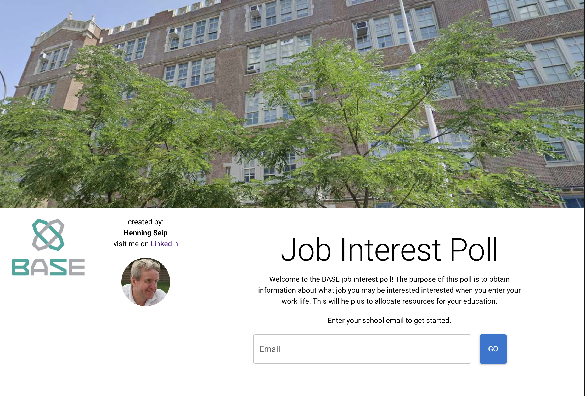
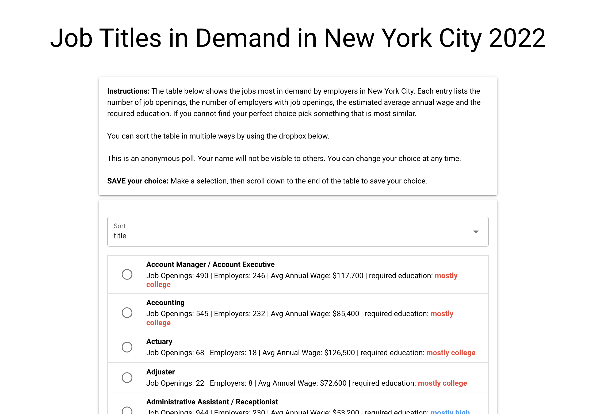

## Building the Client (Part 1)

We will be creating three pages:  
### Home Page  


### Poll Page


### Results Page


In VSCode start a new **Terminal** and change the directory to **client**:
```
cd client
```

Now we install the graphics package that will help us display the chart. In the Terminal enter:
```
npm i vue-google-charts
```

Download images:  
https://candogram-downloads.s3.amazonaws.com/student-poll-images.zip  

In VSCode click on the **client**. This will open the subdirectories.
Before we begin we need to clean up the default app by deleting some files and folders:  
- /public => delete all file(s) and folder(s)
- /src => delete the **assets** folder
- /src/components => delete all file(s)
- /src/pages => delete IndexPage.vue

From the unzipped images
- copy the folder **icons** and **favicon.ico** to the **/public** folder.
- copy the folder **assets** to the **/src** folder


Open the page /src/layouts/MainLayout.vue. Delete all contents. Add the following code:
```
<template>
  <q-layout view="lHh Lpr lFf">
    <q-page-container>
      <router-view />
    </q-page-container>
  </q-layout>
</template>

<script>

export default {
  name: 'MainLayout'
}
</script>
```
Close the MainLayout.vue file.
Click on the **pages** folder and create three files:
- HomePage.vue
- PollPage.vue
- ResultsPage.vue

Click on the router directory and open the routes.js file. In the file change the first route target file from **IndexPage.vue** to **HomePage.vue** and add the name attribute.   
Next add the two addtional routes. The changed routes.js file should look like this:
```
const routes = [
  {
    path: '/',
    component: () => import('layouts/MainLayout.vue'),
    children: [
      { path: '', component: () => import('src/pages/HomePage.vue'), name: 'Home' },
      { path: 'poll/:user', component: () => import('src/pages/PollPage.vue'), name: 'Poll' },
      { path: 'results', component: () => import('src/pages/ResultsPage.vue'), name: 'Results' }
    ]
  },

  // Always leave this as last one,
  // but you can also remove it
  {
    path: '/:catchAll(.*)*',
    component: () => import('pages/ErrorNotFound.vue')
  }
]

export default routes
```


Doubleclick the file **quasar.config.js**. Find the line **vueRouterMode: 'hash'**. Replace **hash** with **history**.

Underneath this entry enter the following code:
```
      env: {
        BASE_URL: 'http://localhost:3000', 
        CREATOR_NAME: 'John Doe',
        CREATOR_EMAIL: 'john@bronxsoftware.org'
      },
      distDir: '../server/public'
 ```     
For the CREATOR_NAME and CREATOR_EMAIL variables use your own information.

In the **devServer** section change the **open** prop to look like this:
```
devServer: {
  open: {
    app: { name: 'google chrome' }
  }
},
```

In the framework section of this file add **'Notify'** to the **plugins** bracket so that it looks like this:
```
plugins: [
        'Notify'
      ]
```


