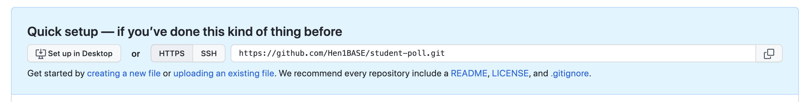

# Github Repository for student-poll

Sign into your Github account.  
Click on **Create repository** (green) button.  
In the **Repository name** field enter **student-poll**  
Keep all other settings. On the bottom of the screen click the **Create repository** button. Your next screen will show the repo setup.  

 . 

Next we prep our project for Github upload.
- In VSCode open our project folder **student-poll**
- Open a Terminal in VSCode

Enter the following commands:
```
git add --all
git commit -m "initial commit"
```

Next use the github link in the blue box. Click the copy button on the right of the link.  
In the Terminal enter the following command and include the copied link: 
```
git remote add origin https://github.com/Hen1BASE/student-poll.git
```
This will connect your local code to the repository on Github.  
Next we **push** our code to Github with the following command:
```
git push -u origin main
```
There will be messages output on you Terminal screen showing the upload.  
On your Github screen click on **student-poll** in the screen header. This will show you your newly saved repo.


